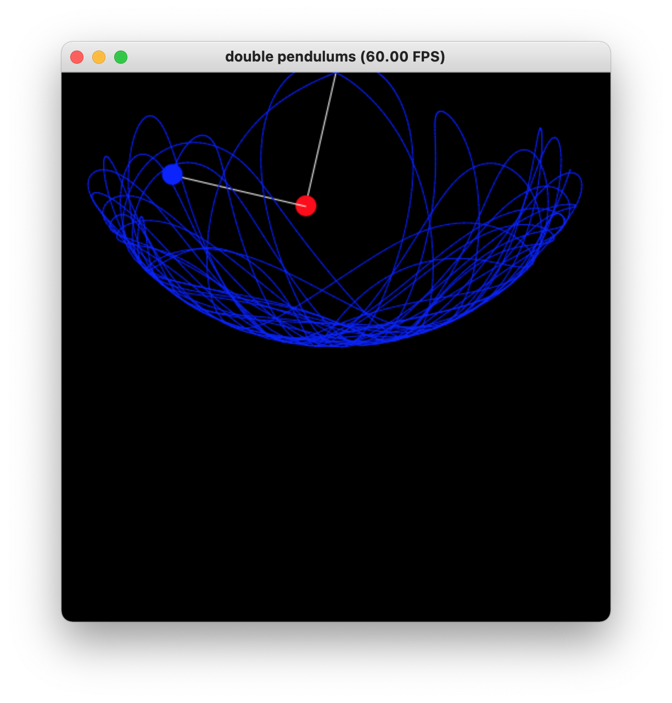

# 太极图形课S1-作业1-双摆

## 背景简介
这里实现了一个简易双摆模拟，不计摆线重力和空气摩擦阻力。给定初始的角度开始模拟后，可以观测到下摆球轨迹的混沌现象。

## 成功效果展示
双摆下摆球轨迹图



## 整体结构
```
-LICENSE
-|data
-README.MD
-pendulums.py
```

## 运行方式
运行：`python3 pendulums.py`
初始时，摆球静止。
请使用t键来选择是否显示轨迹，使用s键来开启和暂停模拟。
静止时，可以使用y键和u键来增加或者减小上摆球的角度，使用i键和o键来增加或者减小下摆球的角度。
运行中暂停，改变摆球角度后，整个模拟将被重置。
